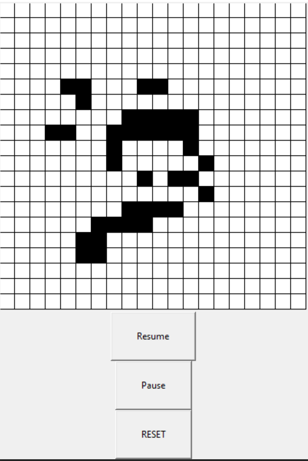

# Conway-s-Game-Of-Life-Python
A python implementation using the Tkinter module to simulate Conway's Game of Life. A good explanation of what this is can be found here: https://en.wikipedia.org/wiki/Conway%27s_Game_of_Life

# Running the program

Simply run main.py to start the application, then click on areas on the grid to activate those cells(to toggle them alive or dead). Once you're happy with your simulation design, press start.

